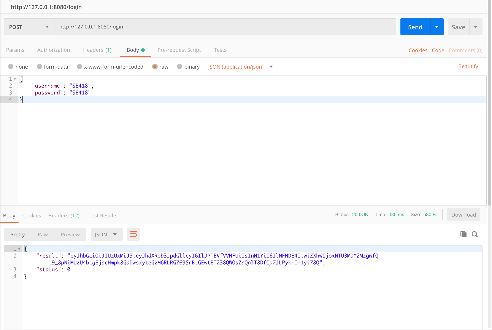
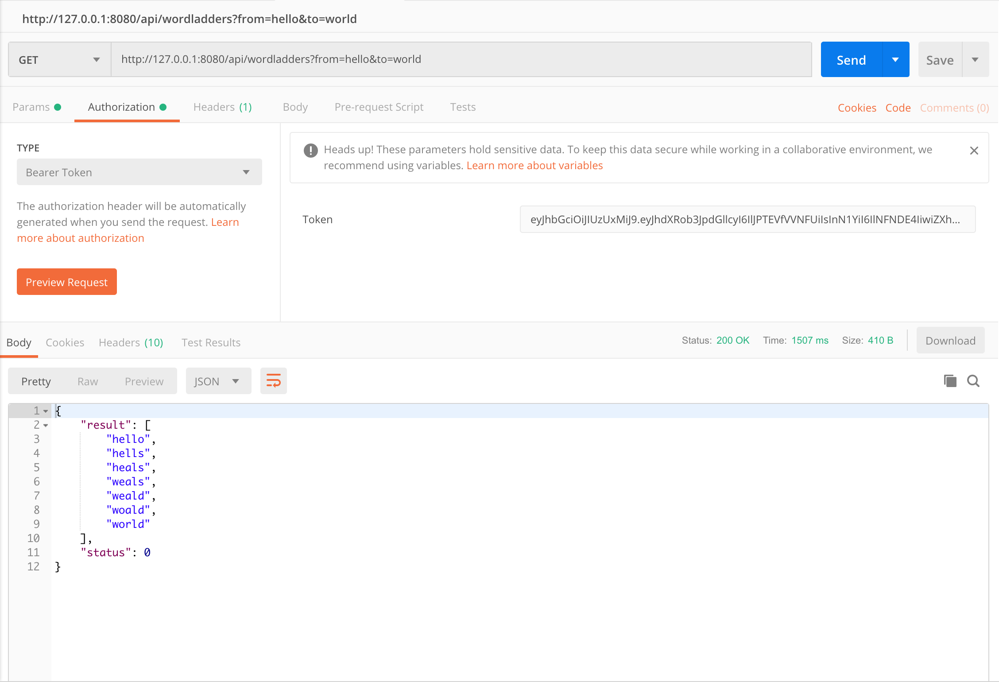

# WordLadder using Spring Boot & docker & microservice

## Build
Type the following script:
```
cd login
mvn clean package dockerfile:build
cd ../play
mvn clean package dockerfile:build
```
Then you will have two docker images named ``shenjiahuan/wordladder-login`` and ``shenjiahuan/wordladder-play``

## Get
You can also pull docker images from Docker Hub
```
docker pull shenjiahuan/wordladder-login
docker pull shenjiahuan/wordladder-play
```
## Run
```$
docker run -p 8080:8080 -p 9000:9000 -d shenjiahuan/wordladder-login
docker run -p 8081:8081 -p 9001:9001 -d shenjiahuan/wordladder-play
```
Port 8080 serves microservice login, 8081 serves microservice play, 9000 and 9001 are two ports which actuators listen.

## Usage
Wordladder application requires login before you can use. You will receive HTTP status 401 when unauthorized. At this stage, username and password are both 'SE418'.  
You can use tools like 'postman' to send HTTP requests, and in this way, you need to *POST* to that url, with data ```{"username":"SE418", "password": "SE418"}``` and Content-Type```application/json``` in request body.  
You will get response like that:

If nothing goes wrong, you will receive a json containing jwt string, which is needed in the following steps.  
After that, if you wish to get a wordladder from 'hello' to 'world', you can get <http://localhost:8080/wordladders?from=hello&to=world> with previous jwt authorization strings.  

`status` in response body has the following meanings:  

`status` | meaning
---- | ---
0 | Nothing goes wrong
-1 |  No ladder exists
-2 | Dictionary not found
-3 | Request format incorrect

## Spring Actuator
Port 9000 is opened for monitoring "login" microservice, and 9001 is opened for monitoring "play" microservice.  
Three endpoints, including health, info, prometheus are opened.
