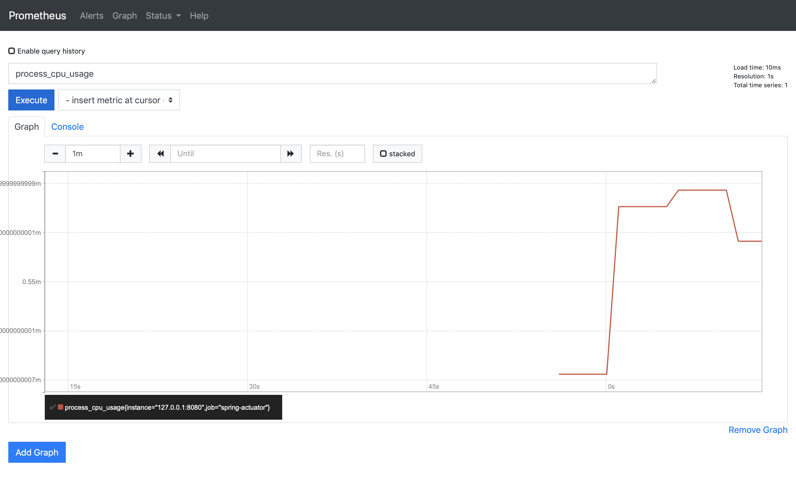
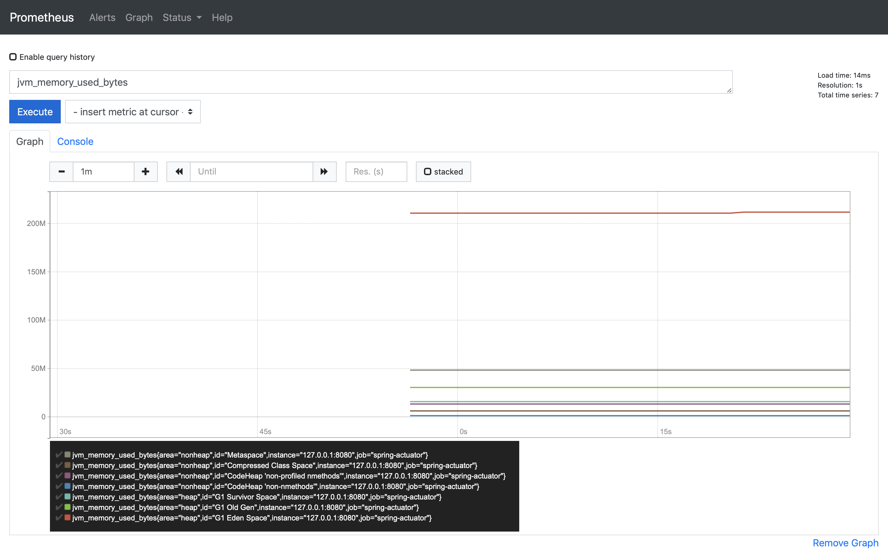
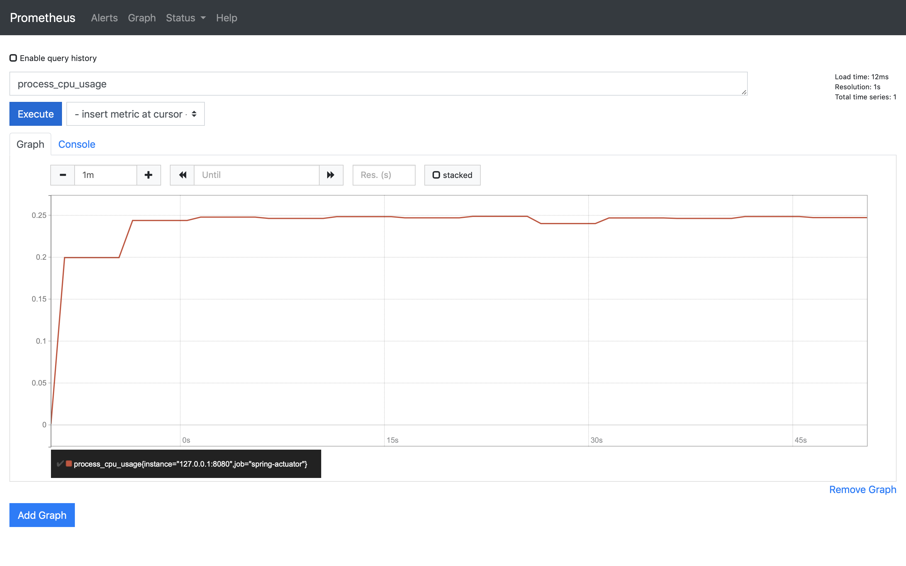
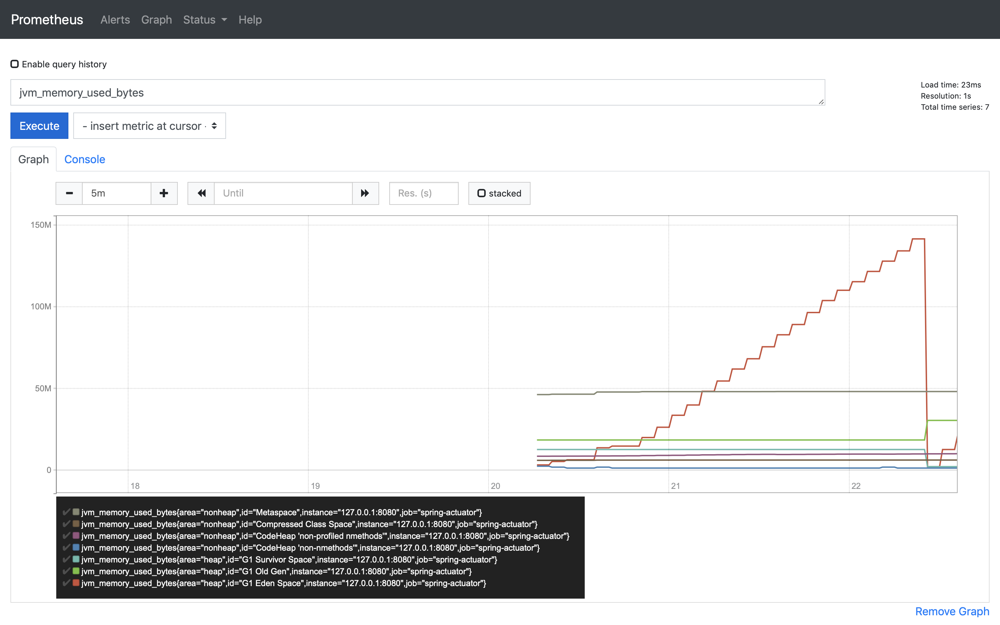
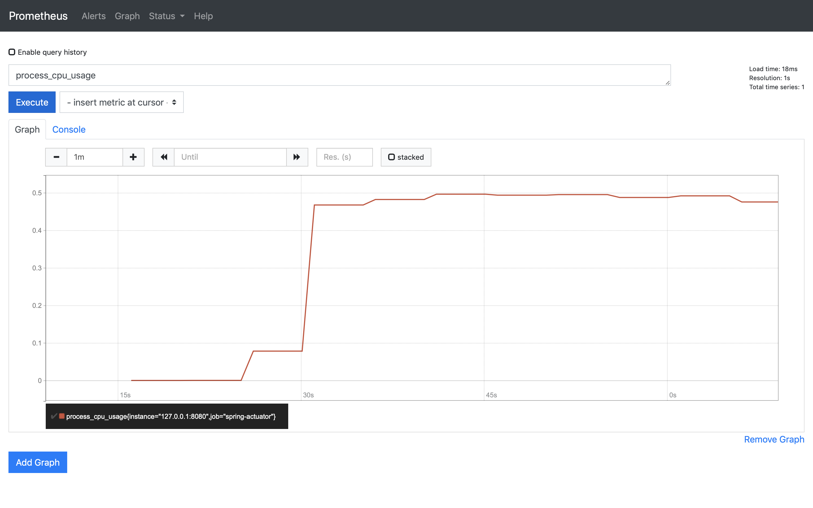
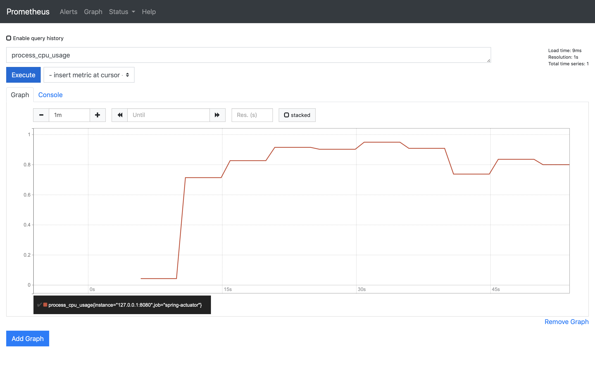
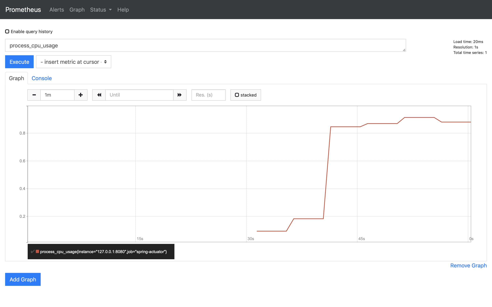
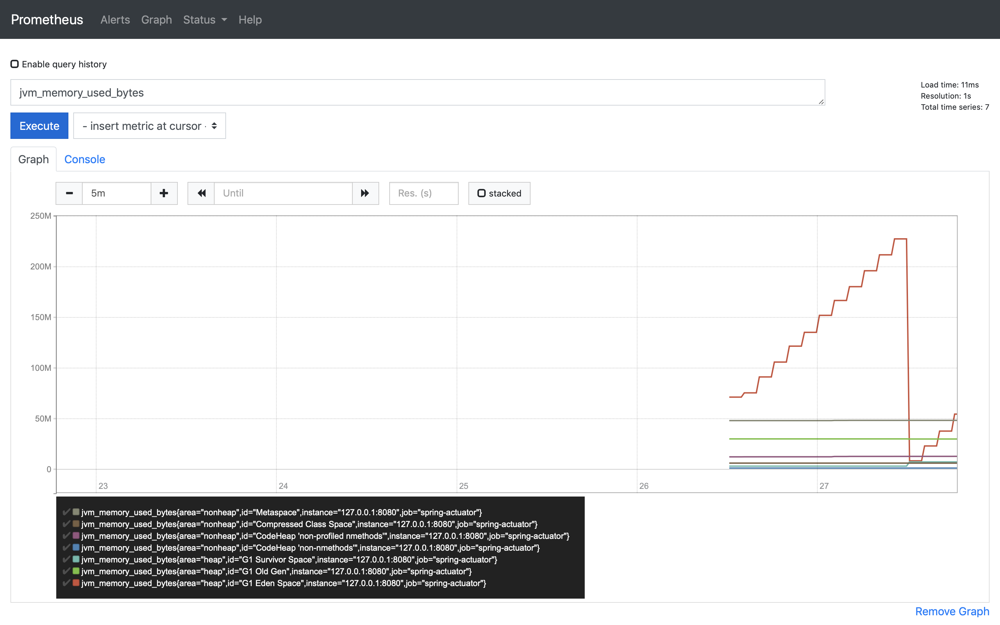
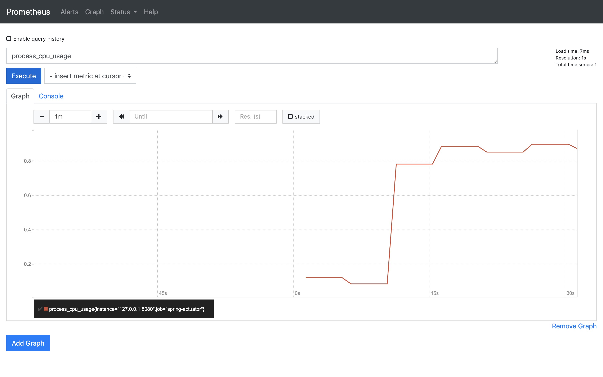

# Resource usage analysis of previous REST service

## Tools
1. ApacheBench  

	> ApacheBench (ab) is a single-threaded command line computer program for measuring the performance of HTTP web servers.
	
2. Postman  
	Postman is a tool to send HTTP requests.
3. Prometheus  
	Prometheus is used to monitor CPU and memory consumption.
	
## Steps
1. Use Postman to make post request to <http://localhost:8080/login> with username and password, and retrieve the returned JSESSIONID.
2. Send concurrent HTTP requests to <http://localhost:8080/wordladders?from=hello&to=world> using ApacheBnech. The number of cuncurrent requests will be 1, 2, 4, 8, 16. The command looks like:
```
ab -n 1000 -c 16 -H "Cookie: JSESSIONID=0F9B30A747AC79DBDACDB4C9BE5CF1EC" http://localhost:8080/wordladders\?from\=hello\&to\=world
```
3. Monitor resource usage in Prometheus. Use ```process_cpu_usage``` to monitor CPU usage and ```jvm_memory_used_bytes``` to monitor memory usage.

## Result
### No request
- CPU:
 
- Memory:
 
 
### 1 concurrent request
- CPU:
 
- Memory:
 
 
### 2 concurrent requests
- CPU:
 
- Memory:
 
 
### 4 concurrent requests
- CPU:
 
- Memory:
 
 
### 8 concurrent requests
- CPU:
 
- Memory:
 
 
### 16 concurrent requests
- CPU:
 
- Memory:
 
 
 ## Analysis
 - My CPU has 4 logic cores, so 1 concurrent request will use up to 25% of the CPU, and 4 concurrent requests will use up all CPU in an ideal condition. And the result confirms this point.
 - While there is no request, JVM already allocated more than 200MB memory. For each given cuncurrent requests, as request numbers grow, memory usage also grow. And to one stage GC (or garbage collector) automatically collected used memory which was used for previous requests. The collecting stage is a constant, so there is no obvious memory trend difference when concurrent number change.

## Findings
One interesting finding through this task, is that while I am analyzing my previous version of code, I notice that memory usage will be extremely high when concurrent number is also high. And memory usage will not decrease when requests finished.  
Later I find out there exists one bug which will occur in concurrent situations. (You can refer to [this commit](https://github.com/ShenJiahuan/SE418/commit/edc77f1a4be866b215ce915f0b50a07b83f79cc5) of what I have done to fix this bug).